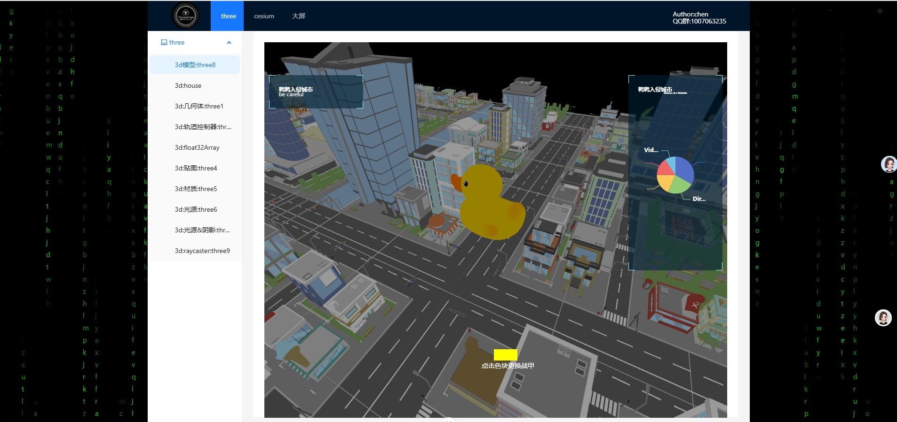
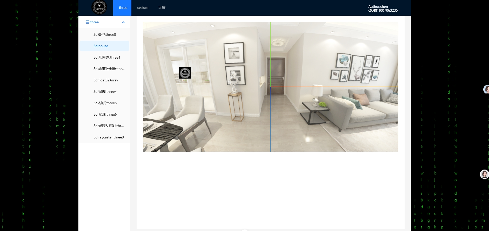
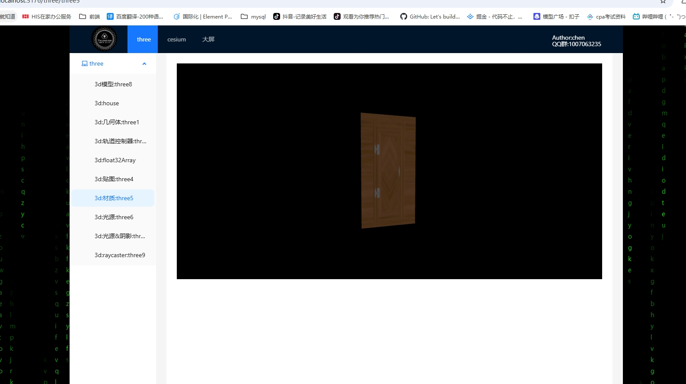
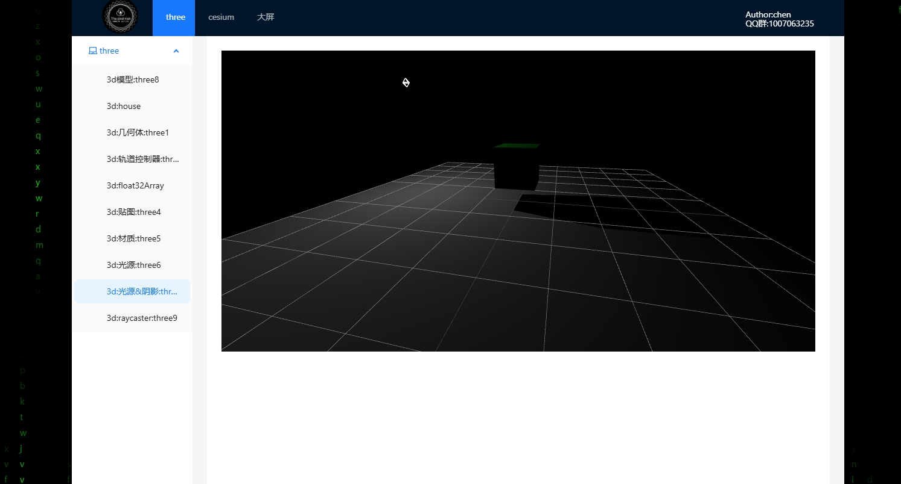
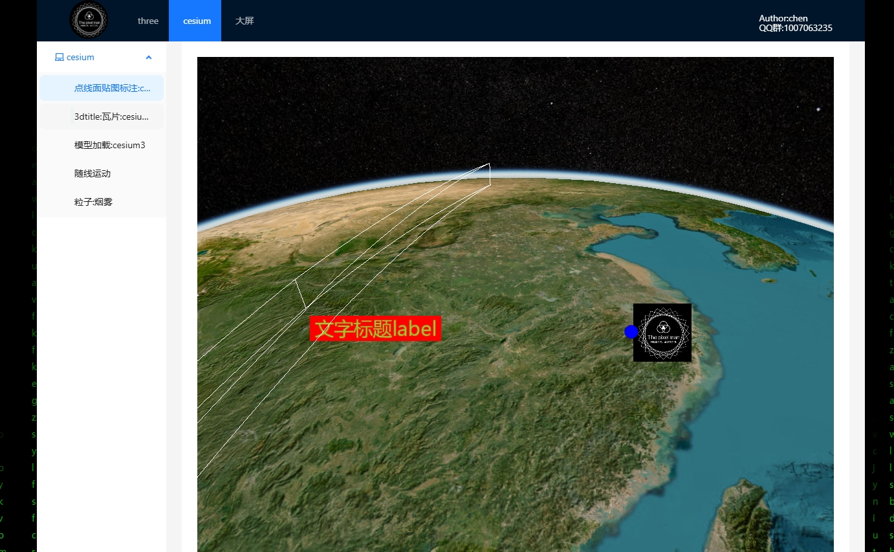
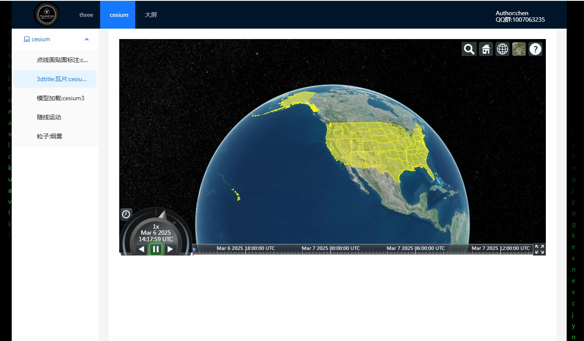
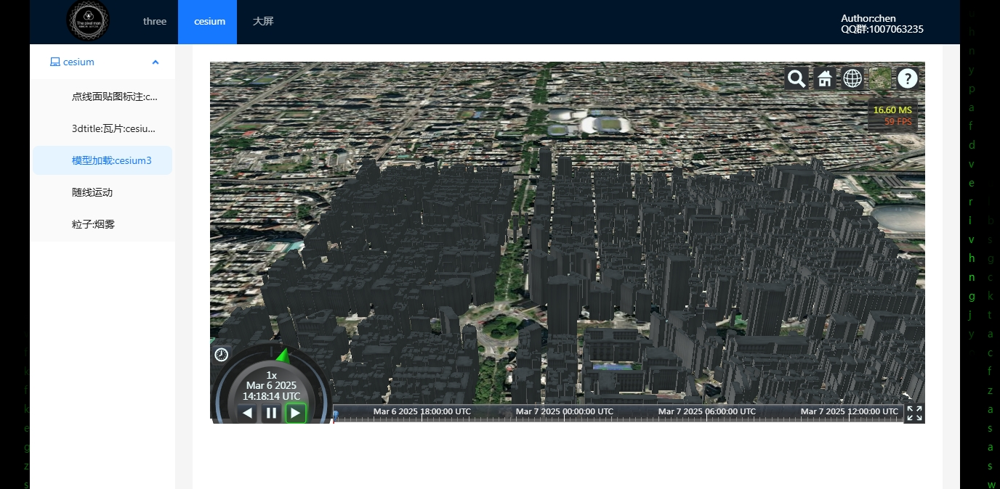
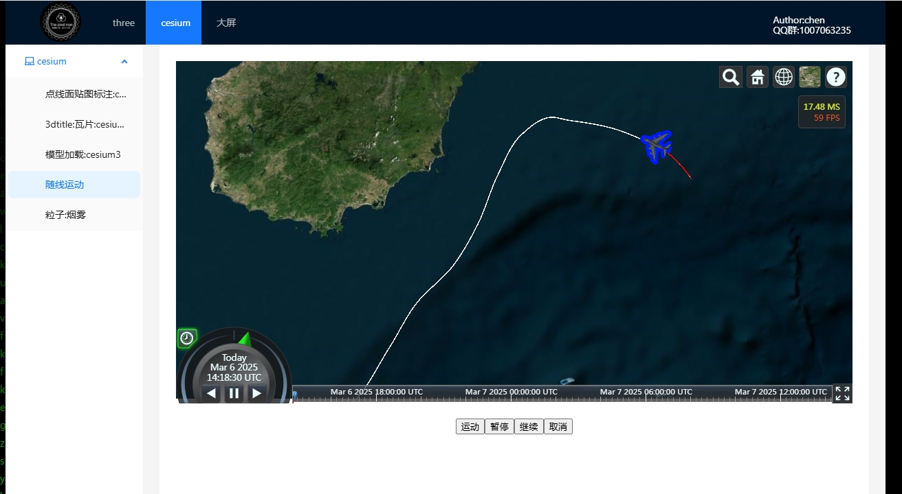
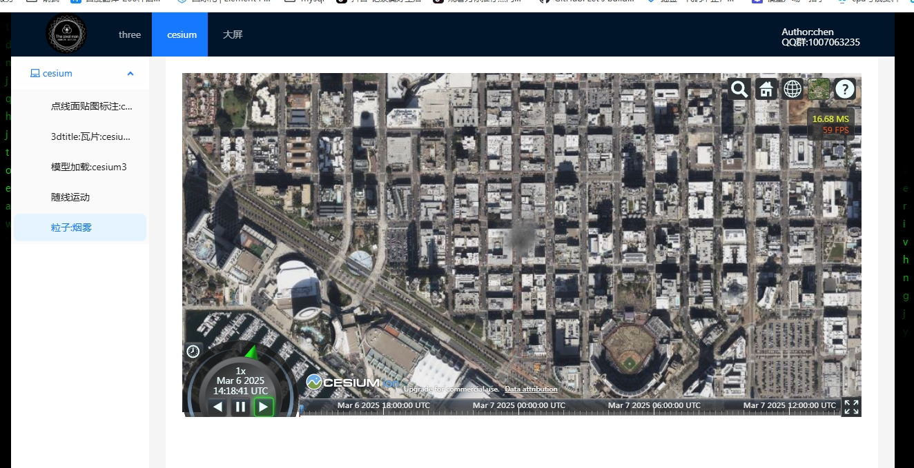

# vue-project
### 项目实例图片










```sh
npm install
```

### development

```sh
npm run dev
```

### build

```sh
npm run build
```

### Lint [ESLint](https://eslint.org/)

```sh
npm run lint
```
